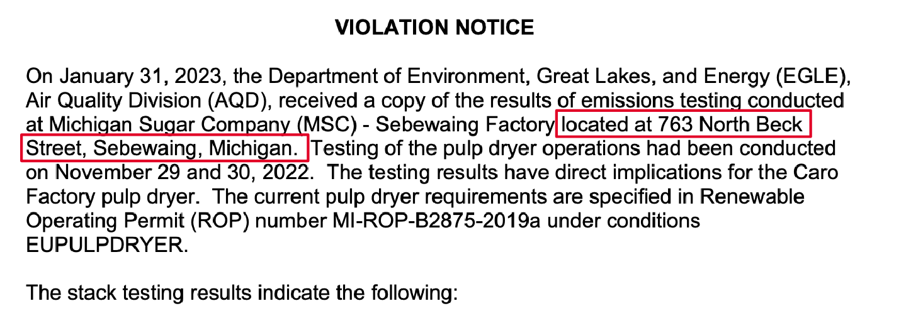
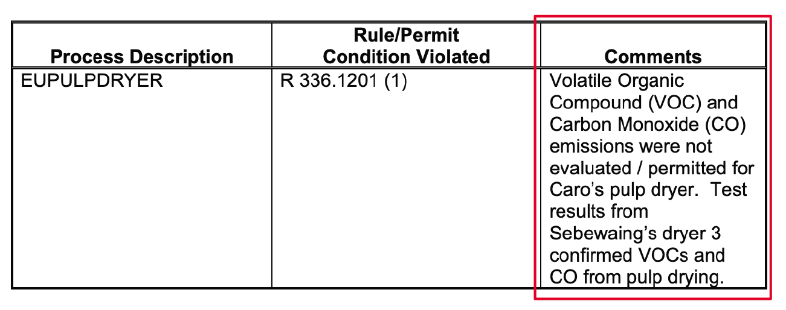

# Planet Detroit's Dashboard of Michigan Air Permit Violations
----
#### by [Shelby Jouppi](https://www.shelbyjouppi.com), Data Reporter
This dashboard contains an interactive map of Michigan facilities that have violatated their [air permits](https://www.epa.gov/sites/default/files/2013-09/documents/cmspolicy.pdf) within the past five and a half years, as well as a digest of the most recent violation notices issued by the Michigan Department of Environment Great Lakes and Energy (EGLE) that oversees the air quality program.

The map updates daily with new violation notices posted to [EGLE's Air Quality Division database.](https://www.egle.state.mi.us/aps/downloads/srn/)

### How it works
🔍 **1. Finding and parsing new violation notices** 

A python script looks for new violation notices added to the EGLE database. [The EGLE Air Quality Division document dataset and methodology can be found here.](https://www.shelbyjouppi.com/egle-air-database). Using the library [pdfplumber](https://github.com/jsvine/pdfplumber) the script searches for standard phrases and tables that indicate which violations are cited in the notice. It also extracts the full text of the PDF.

:chart_with_upwards_trend: **2. Clean and save the data**

The script then cleans the violation details and saves it to a csv with the following fields:

📁 `output/EGLE-AQD-Violation-Notices-2018-Present.csv`

| field    | description |
| -------- | ------- |
| srn  | The facility's unique State Registration Number. |
| facility_name | Name of the facility according to this [directory.](https://www.deq.state.mi.us/aps/downloads/SRN/Sources_By_ZIP.pdf) |
| epa_class | The classifcation assigned to the facility by the EPA based on the amount of hazardous or cumulative air pollutants it emits. In order of severity, the classes are "Megasite", "Major", "Synthetic Minor", "True Minor." |
| date | The date the violation was issued, according to EGLE's file naming convention. [Read more](https://shelbyjouppi.com/egle-air-database/)|
| comment_list | A list of comments extracted from the violation table in the notice. If no table was parsed, then it is likely the parser found a standard violation like a "Failure to submit [YEAR] air pollution report" or a "second violation notice." |
| address_full | The address of the facility according to this [directory.](https://www.deq.state.mi.us/aps/downloads/SRN/Sources_By_ZIP.pdf) This is often, **but not always** reflective of exact locations of facilities. |
| location_clean | The location of the violation. Most of the time this matches the address of the facility, but occasionally there are different locations associated with the same SRN.|
| doc_url | The url for the violation notice hosted on EGLE's database. |
| full_text | A raw copy of the entire text of the violation notice as extracted by pdfplumber. |

:round_pushpin: **3. Update the map with the new violations**

The script then updates the facilities with new violation notices by adding to the total violation count for that facility as well as the year and updating its article with the new violation text.

It then exports another file with the top 12 most recent violation notices to populate the dashboard.

------

### A few notes regarding our methodology

`violationCount`: is derived from adding up the number of violation notices in the EGLE database since 2018. This number could be higher if EGLE has not uploaded every violation notice.

We limited the violation notices within the past five and a half years, however there could be relevant violation notices predating this period. To search past violation notices, use the [full document dataset](https://www.shelbyjouppi.com/egle-air-database) and contact EGLE for the most comprehensive list.

If you have obtained violation notices that are not in the dataset, please submit them [to this form](https://forms.gle/Km4YamzdXB9aZpvV8) and we will get them added as soon as we are able.

`facility_name`, `address`, `epa_class`: Information about these facilities was derived from a spreadsheet provided by EGLE in early 2022. There is always a potential that some of this information might have changed or that new facilities have popped up that aren't included in the database.

The facilities were mapped using the address provided, but that address might not always be the exact physical location of a polluting facility. Please check the violation notice PDF for more detail about the location.

Please report any errors to [this form](https://forms.gle/Km4YamzdXB9aZpvV8) and we will correct them as soon as possible.

`location_clean`: The location of the facility cited in the violation was extracted by searching for the text "located at [address], Michigan." on the front page. The map only serves this data if it doesn't match the facility's address in the directory.

`violation_text`: This text was extracted by using the python library pdfplumber to isolate the standard table on the violation notice. Due to the technical jargon in the "Process Description" and "Rule/Permit Condition Violated" columns, we only included the Comments column on the map. The data from the other columns can be found in `archive/violations-parsed-raw.csv.`

This technology expedited a process that would have taken weeks of manual labor, and allows the map to be updated daily without human intervention. However, automation isn't perfect, so there might be typos or other issues with the text that is displayed. Please always verify the details of the violation by looking at the Violation Notice PDF itself.

### The files
| file    | description |
| -------- | ------- |
| `EGLE-AQD-violation-parser-mapbuilder.py` | is the python script that runs the violation parser and updates the map with new violations. It runs daily using Github Actions. |

:file_folder: `output/`

| file    | description |
| -------- | ------- |
`EGLE-AQD-Violation-Notices-2018-Present.csv` | Each violation notice issued since 2018 parsed. See details above.|
`violation-map-data.csv` | A .csv version of the data used to populate the map. Each record represents one source.
`violation-map-geo-data.js` | The javascript file used to populate the map.|
`recent-map-violations.js` | The javascript file used to populate the most recent violation notices on the dashboard.|
`report-map-update.csv` | Shows which sources were updated on the map by the script each day. |

:file_folder: `docs/`

| file    | description |
| -------- | ------- |
|`EGLE-AQD-source-directory-geocoded.csv` | A directory of sources with their `epa_class`, `address`, and geocoded (`lat`, `long`) using Google Maps API. This may contain errors, so please [report any issues using this form](https://forms.gle/Km4YamzdXB9aZpvV8).|
|`violation-map.css` | The stylesheet for the violation dashboard.|
| `dashboard.js` | The javascript for the violation dashboard interactivity. |

:file_folder: `archive/`

| file    | description |
| -------- | ------- |
| `violations-parsed-raw.csv` | A raw copy of the output of the violation parser. One violation notice may have multiple records depending on the number of "comments" found in the violation table. Novel fields included are `process_description` and `rule_permit_condition_violated.`|
